# Knowledge-base pipeline — BanglaHomeoRAG (G14)

Fixed stage order (`src/doc_agent/pipeline.py::build_knowledge_base`, CI-enforced — do not reorder).
Two stages are config-switched based on measured held-out CER rather than hard-coded.

```mermaid
flowchart TD
    A["Raw scans\ndata/raw/&lt;book&gt;/*.png\n(1,107 pages: bk1=662 test, bk2=445 train)"] --> B["1 Ingest\nloader.load_pages\n-&gt; Page(id, image_path, doc_id)"]
    B --> C["1 Preprocess\npreprocess.run\nmode: passthrough + autocontrast\n(measured CER 0.174 vs 0.213 classical)"]
    C --> D["1 Enhance — OFF\nenhance.run\nenabled: false\n(speciality = code-switching, not degraded scans)"]
    D --> E["2 Layout\nlayout.detect -&gt; list[Region]\nmode: whole_page\n(CER 0.184 vs 0.483 for block segmentation)"]
    E --> F["3 OCR\nocr.transcribe -&gt; list[Chunk]\nTesseract 5 ben+eng, PSM 3\nreads original image (DPI-safe)\nTSV parsed with QUOTE_NONE"]
    F --> G{{"hooks.AFTER_OCR\nPII redaction seam"}}
    G --> H["4 Chunk\nchunk.split -&gt; list[Chunk]\nNFC normalize + remedy-alias markers\nentry-aware, 512 tok / 64 overlap fallback"]
    H --> I{{"hooks.BEFORE_INDEX"}}
    I --> J["4 Embed\nembed.encode -&gt; float32[n,1024]\nBAAI/bge-m3, fp16 on GPU, batch=4"]
    J --> K["4 Store\nstore.build -&gt; FAISS Flat index\nL2-normalized vectors (cosine via inner product)\ndata/interim/index/ (atomic write)"]
    K --> L["Retrieval-ready index\n(A3: retrieve -&gt; rerank -&gt; agent loop)"]

    style D fill:#eee,stroke:#999,color:#666
```

## Stage → file → data-contract map

| # | Stage | Code | In → Out (contract) | Key config |
|---|---|---|---|---|
| 1 | Ingest | `ingest/loader.py::load_pages` | `cfg` → `list[Page]` | `paths.raw_dir` |
| 1 | Preprocess | `ingest/preprocess.py::run` | `list[Page]` → `list[Page]` (cleaned image) | `preprocess.mode: passthrough`, `autocontrast: true` |
| 1 | Enhance (off) | `ingest/enhance.py::run` | `list[Page]` → `list[Page]` (pass-through) | `enhance.enabled: false` |
| 2 | Layout | `vision/layout.py::detect` | `list[Page]` → `list[Region]` | `layout.mode: whole_page` |
| 3 | OCR | `vision/ocr.py::transcribe` (`Reader`) | `list[Region]` → `list[Chunk]` (one per page, `ocr_conf` set) | `ocr.engine: tesseract`, `ocr.lang: ben+eng`, `ocr.body_psm: 3` |
| — | *hook* | `hooks.py::run(AFTER_OCR)` | PII redaction seam over OCR text | `governance/pii.py` |
| 4 | Chunk | `index/chunk.py::split` | `list[Chunk]` (page text) → `list[Chunk]` (indexable pieces) | `index.chunk_tokens: 512`, `index.overlap: 64`, `normalization.remedy_aliases` |
| — | *hook* | `hooks.py::run(BEFORE_INDEX)` | pre-index seam | — |
| 4 | Embed | `index/embed.py::encode` | `list[Chunk]` → `float32[n, 1024]` | `embed.model: BAAI/bge-m3`, `embed.use_fp16: true` |
| 4 | Store | `index/store.py::build` | `(chunks, vectors)` → persisted FAISS index | `index.type: faiss:flat` |

## Why the two switched stages are drawn this way

- **Enhance is OFF, not deleted** — the stage exists (structure-gate requires it) but our data speciality is code-switching, not physically degraded scans, so a learned enhancement model wasn't justified.
- **Layout runs in `whole_page` mode, not deleted** — same reasoning: `layout.detect` still executes and returns `list[Region]` every run (CI-enforced stage order), but on this single-column corpus it returns one full-page region instead of segmenting into blocks, because segmenting measurably hurt OCR accuracy (0.483 → 0.184 mean CER on 30 held-out pages, with block segmentation causing catastrophic failures up to CER 5.69 on ~9 pages). `layout.mode: blocks` remains available if a future corpus needs true multi-column/footnote separation.

## Open item

Held-out OCR CER is **0.184**, above the A1 target of **≤ 0.15**. The layout/OCR-parsing bugs found while measuring this (DPI loss on re-saved crops, TSV quote-swallowing) are fixed; closing the remaining gap is a separate lever — preprocessing tuning or the planned Bangla neural OCR fallback — tracked for A3.
